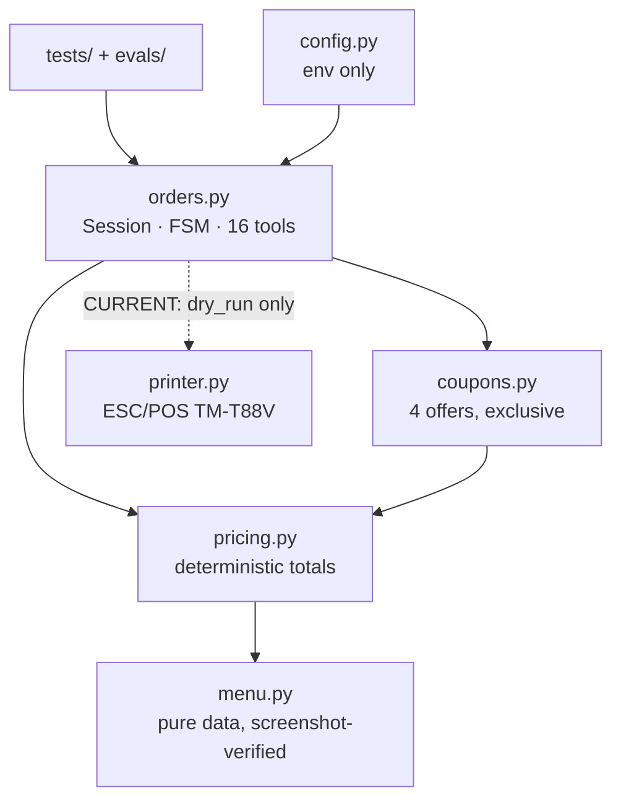
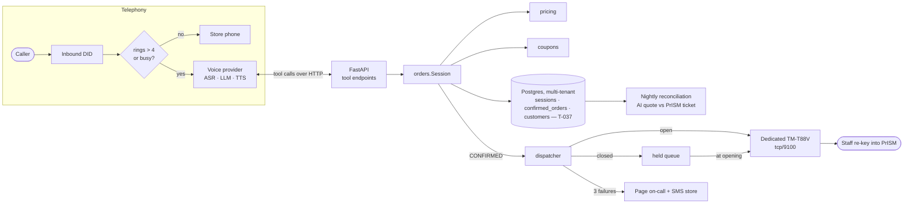
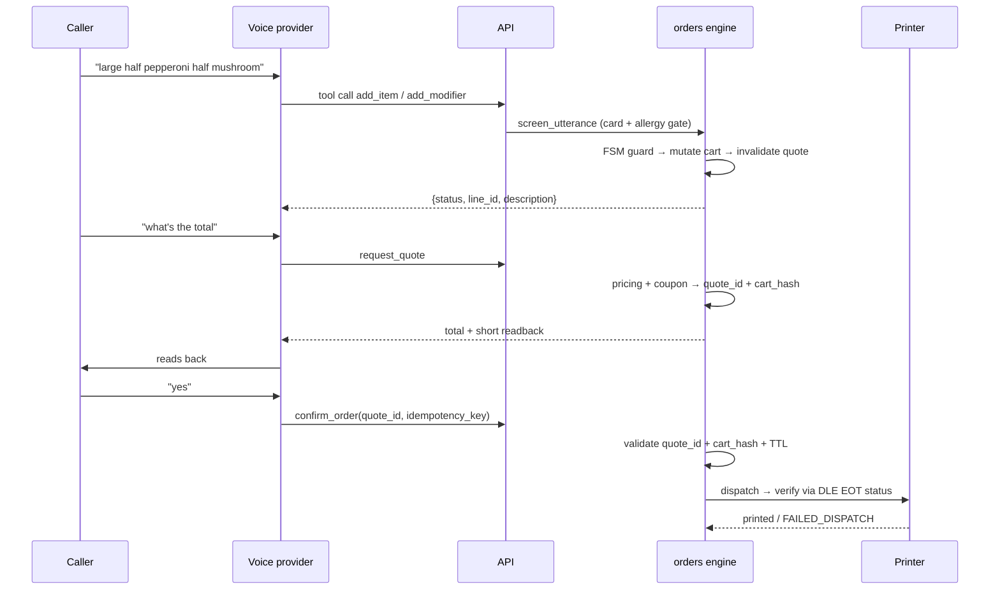

# Architecture

Two diagrams: what exists today, and what pilot needs. Everything is labeled.

## CURRENT (verified by audit)

A pure-Python library and persistent text sandbox. Optional LLM network access;
no server or voice. Runtime dependencies: none (stdlib only).

Customer text → LLMInterpreter → LLMProvider (`AnthropicProvider` or
`OpenAIProvider`) → existing ToolCall / orders.TOOLS → deterministic engine.
OpenAI uses Responses API function calls and bounded tool-result continuation;
Anthropic retains its Messages API behavior. The interpreter stages in-memory
session changes and commits after a successful turn, so provider failures do
not leave partial cart/quote mutations. Vendor protocols remain confined to
`llm_provider.py`. Schemas are introspected; confirmation credentials are
server-injected. See STATUS.md for deterministic verification and live blockers.

**State lives in a `Session` dataclass held in memory.** It dies with the
process. This is fine for a library and unacceptable for a phone call — see
Phase 3.

## TARGET (pilot)

**Service boundaries.** One deployable process. The pieces stay separable by
module, not by network hop — a single store does not justify microservices.

## Request lifecycle

## APIs

**CURRENT:** in-process Python functions. `orders.TOOLS` is the exact list of 16
callables exposed to a model. Every one takes `Session` first.

**PLANNED:** a thin HTTP layer that maps 1:1 onto `orders.TOOLS`. It must add no
business logic — if a rule lives in the HTTP layer, it is in the wrong place.

Two invariants, both enforced by tests
(`test_f1_no_tool_accepts_a_price`, `test_f2_no_tool_accepts_store_id`):
no tool takes a price; no tool takes `store_id`.

## Storage

**CURRENT (T-037): Postgres, single instance, multi-tenant schema.**
`lakewood/persistence/` — a repository interface (`SessionRepository`) with
two implementations: `InMemorySessionRepository` (zero dependencies; what the
full test suite and the T-016 offline gate actually run against) and
`PostgresSessionRepository` (real Postgres, `psycopg2` lazy-imported, same
pattern as the STT provider below). Full reasoning, including why Postgres
was chosen over the SQLite this row used to say, and why in-memory-not-
containerized is the offline gate's verification path:
`docs/decisions/ADR-014-persistence-postgres-multitenant.md` (supersedes
ADR-005).

`orders.py`/`pricing.py`/`menu.py`/`coupons.py` are unchanged by this —
persistence is a side-car that saves/loads a `Session` via
`serialization.py`, never a domain-layer import.

| Table | Purpose |
|---|---|
| `stores` | store_id (tenant root), name, inbound_did |
| `customers` | store_id, customer_id, phone_normalized — never the raw phone as a key |
| `sessions` | store_id, call_id, customer_id, from_number, state, turn, session_json (full `Session` snapshot), created_at, updated_at |
| `confirmed_orders` | store_id, order_id, call_id, customer_id, total_cents, ticket, idempotency_key, confirmed_at, session_json — insert-only (F12) |

Every table above carries `store_id` in its primary key or a foreign key back
to one that does — cross-tenant reads are structurally impossible, proven by
`tests/test_persistence_tenant_isolation.py` and (offline, no server)
`tests/test_persistence_schema.py`. **Not yet built** (later phases, per
ADR-014 Decision 3 and 6): a normalized cart/line-item schema (JSONB blob is
sufficient at MVP scale), `order_events` as its own append-only table (folded
into `session_json`/`confirmed_orders.session_json` for now), `held_orders`,
`reconciliation`, and any scheduled retention sweep (the purge functions
exist in `retention.py`; nothing calls them on a schedule yet — no
cron/task-runner in this codebase).

**Recovery:** a dropped call's cart is offered back, never silently resumed —
`lakewood/persistence/recovery.py` + `service.py::resume_or_create`, a 30-
minute resume window, unconditional re-validation and re-pricing against the
CURRENT menu before anything is quoted (a `cart_hash` match proves contents
didn't change, never that today's price is the same one quoted before).
**CURRENT (T-038 Phase 1):** `chat.py::PersistentChat` wires this into the
text path, with one executor shared by rule-based and staged LLM tools;
confirmation uses durable persistence. Voice, TTS, and telephony remain
PLANNED.

## State machine

Defined in `docs/order-state-machine.md`, implemented in `orders.py`. Key
properties:

- Any cart mutation while `QUOTED` or `AWAITING_CONFIRMATION` returns to
  `BUILDING` and voids the quote.
- `confirm_order` requires matching `quote_id` **and** `cart_hash` **and** an
  unexpired quote.
- `CONFIRMED` is not terminal — the order continues to `SENT_TO_STORE` →
  `STORE_ACKED`, or `HELD_FOR_OPEN`, or `FAILED_DISPATCH`.

## External providers

| Concern | Choice | Lock-in risk |
|---|---|---|
| Telephony | Twilio or Telnyx | low — DID portable |
| Voice agent (ASR/LLM/TTS) | **decision pending — ADR-004** | medium; keep behind an interface |
| Printer | Epson TM-T88V, ESC/POS over tcp/9100 | none, open protocol |
| POS | PrISM — **no integration**, staff re-key | none by design |

Provider types must not appear in `pricing.py`, `orders.py`, or `menu.py`.

## Auth, authz, secrets

- **CURRENT:** none needed — a library.
- **PLANNED:** the voice provider authenticates to the tool API with a shared
  secret; store scope is derived from the inbound DID, never from the request
  body. Staff dashboard is a signed link. Secrets from environment only;
  `config.py` reads no literals.

## Observability

**PLANNED.** Structured JSON logs, one line per tool call:
`{call_id, store_id, tool, latency_ms, result_code, cart_hash, state}`.

Metrics that matter: cost per call, transfer rate by reason, dispatch failure
rate, quote-vs-register delta, after-hours captures.

Alerts: any `FAILED_DISPATCH`; dispatch failure rate > 2%/hour; cost per call
above budget; printer offline.

## Error handling, retries, idempotency

- Tools return structured refusals (`{status: "error", code, message}`). They do
  not raise into the model's context.
- `confirm_order` is idempotent by key — a retried confirm after a dropped call
  returns the original order (`test_f6_confirm_is_idempotent`).
- Print dispatch: 3 attempts with backoff, verified by status query, then
  `FAILED_DISPATCH` + page.
- Unknown price → refuse, never estimate.

## Caching and rate limits

Menu is a module constant — no cache needed. **PLANNED:** per-number call rate
limit to bound abuse cost, and a hard per-call duration cap (already enforced at
8 minutes).

## Environments

| Env | Shape |
|---|---|
| **Local** | `pip install -r requirements.txt` + `./scripts/check.sh`. No services. |
| **Staging** | Same process, `PRINTER_DRY_RUN=1`, a test DID, real voice provider. |
| **Production** | Single small VM or container. Postgres on a persistent volume. |

## Backup and recovery

**PLANNED.** Nightly Postgres dump off-box; retention per ADR-014 (24h
in-flight sessions, 400 days confirmed orders). Recovery target: restore and
be answering calls within one hour. The store's fallback during any outage is
their own phone line — which is why automatic failover is a pilot
requirement, not a nice-to-have.

**In-flight session recovery (T-037, CURRENT — the application-level piece,
distinct from the infra-level nightly backup above):** a dropped call's cart
survives a process restart and is offered back to the customer on a callback
within a 30-minute window, re-validated and re-priced against the current
menu before anything is quoted — never silently resumed. See ADR-014 and
`lakewood/persistence/recovery.py`. Not yet wired into a live call loop (no
voice/telephony layer exists yet to call it from).

## Failure handling

| Failure | Behavior |
|---|---|
| Service down | DID fails over to the store's real line |
| Printer offline | 3 retries → `FAILED_DISPATCH` → page + SMS the store |
| Voice provider down | fail over to the real line |
| Unknown price | refuse and transfer |
| Model produces nonsense twice | transfer (`MAX_PARSE_FAILURES`) |
| Call drops mid-order | cart persisted, offered back (re-validated + re-priced) on a callback within 30 min (`lakewood/persistence/recovery.py`, T-037/ADR-014) — the storage + revalidation is CURRENT; a real call loop to actually detect "this is a callback" and drive the offer is **PLANNED** (needs the voice/telephony layer) |
